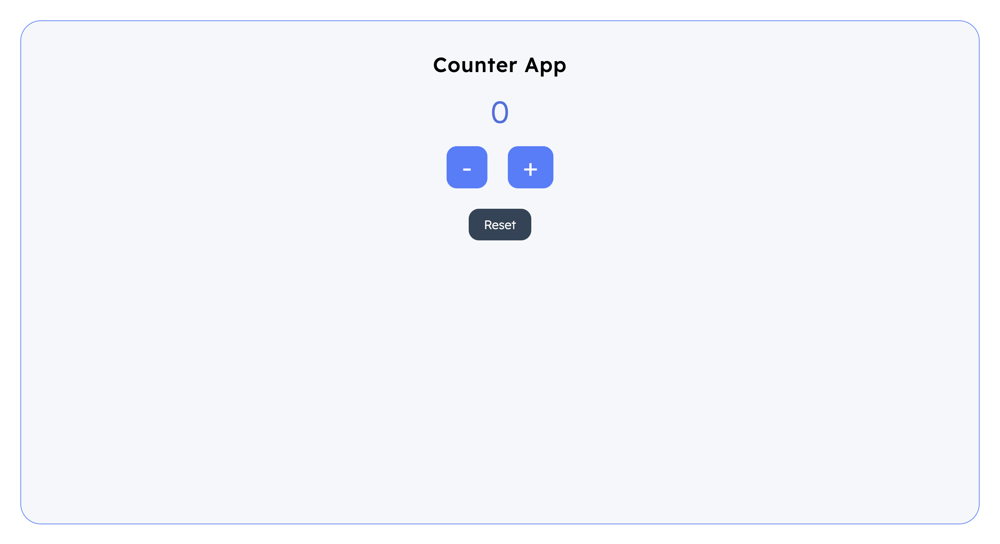

## Counter App

A simple and clean **Counter App** built using **HTML, SCSS, and JavaScript**.  
I created this project while practicing **DOM Manipulation** and **dynamic UI updates**.

---

## 🚀 Live Demo  
🔗 **https://dev-hamza03.github.io/js-counter/**

---

## 📂 GitHub Repository  
🔗 **https://github.com/dev-hamza03/js-counter**

---

## ✨ Features

- ➕ Increase counter  
- ➖ Decrease counter  
- 🔁 Reset counter  
- 🚫 Prevent negative values  
- 🎨 Smooth button click animations  
- 💎 Clean and responsive UI (built with SCSS)  
- ⚡ DOM manipulation with JavaScript  

---

## 🛠️ Technologies Used

- **HTML5**
- **SCSS (Sass)**
- **JavaScript (DOM)**
- **GitHub Pages** for hosting

---

## 📘 What I Learned

- Selecting and updating DOM elements  
- Handling user interactions with **event listeners**  
- Controlling UI changes dynamically  
- Using \`classList\` for animations  
- Writing cleaner and modular SCSS using mixins  
- Deploying projects using **GitHub Pages**

---

## 📦 Installation

If you want to run the project locally:

```bash
git clone https://github.com/dev-hamza03/js-counter
cd js-counter
open index.html
```

---

## 🤝 Contributing

Pull requests are welcome.  
For major changes, open an issue first to discuss what you’d like to change.

---

## 📝 License

This project is **open-source** and available under the MIT License.

---

## 👤 Author

**Hamza Khan**  
